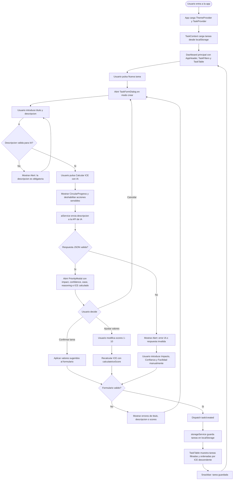
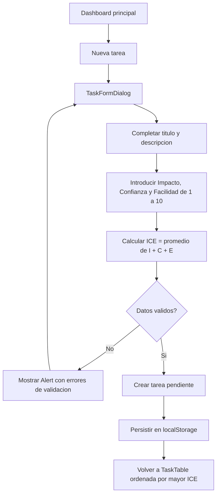
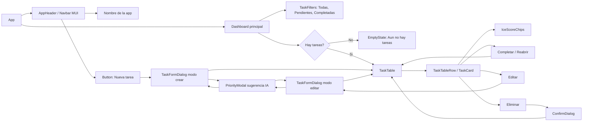
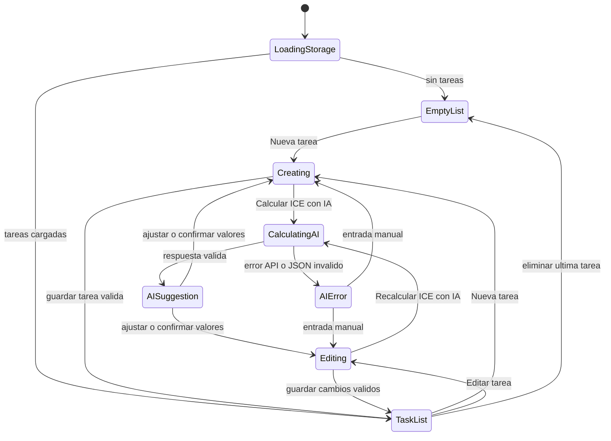

# Diagramas de Flujo - Gestor de Tareas ICE

Este documento describe los flujos funcionales del MVP segun `MVP_ALCANCE_FUNCIONAL.md`, la guia tecnica `GUIA_CONTROL_DESARROLLO_REACT.md` y el mockup visual `pantallas-gestor-tareas-ice-mui.png`.

El producto se plantea como una aplicacion React de una sola pantalla principal, apoyada en componentes de Material UI y dialogos modales para crear, editar y confirmar sugerencias ICE.

## Diagrama: Crear tarea con ICE sugerido por IA

## Diagrama: Crear tarea manual sin IA

## Diagrama: Navegacion del usuario en el MVP

## Diagrama: Estados de interfaz

## Notas de alcance

- No hay rutas, autenticacion, backend, paginacion, analitica ni settings en el MVP.
- La navegacion real ocurre mediante estado local/global, filtros y dialogos MUI.
- La IA solo sugiere valores ICE; el usuario siempre puede confirmar, ajustar o introducir valores manuales.
- El score se calcula como promedio: `(Impacto + Confianza + Facilidad) / 3`, con un decimal.
- Las tareas se muestran por defecto ordenadas de mayor a menor `iceScore`.
